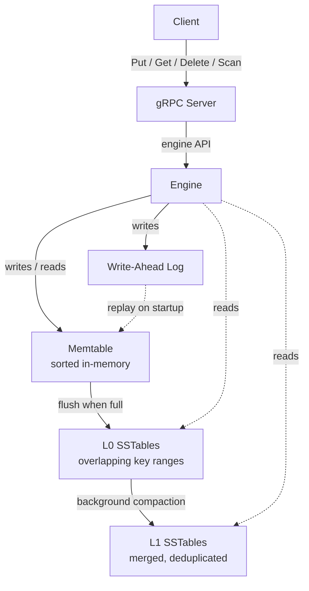

# KV Engine

[](https://github.com/IsaacCheng9/kv-engine/actions/workflows/test.yml)

A C++23 LSM-tree key-value store with crash recovery and a gRPC API
supporting point operations and server-streaming range scans.

Implements the LSM-tree design from O'Neil et al. (1996), structurally
similar to LevelDB and RocksDB.

## Key Features

- **Write-ahead logging** – crash recovery via WAL replay with CRC32 integrity
  checks and length-prefix framing
- **Sorted in-memory memtable** – `std::map`-backed structure with
  `std::shared_mutex` for concurrent reads and exclusive writes
- **SSTable persistence** – sorted, immutable on-disk files with index blocks
  and footer for efficient point lookups
- **Multi-level reads** – memtable first, then SSTables from newest to oldest
  with first match winning and tombstone semantics for deletes
- **Levelled compaction** – background thread merges L0 SSTables into L1 with
  fine-grained locking, so reads and flushes continue during compaction
- **SSTable reader cache** – parsed readers (index + file descriptor) stay
  resident for each file's lifetime, and `pread`-based positioned reads make
  them safe to share across concurrent `get()` callers; eliminates the open +
  footer + index parse that would otherwise happen on every lookup
- **Per-SSTable Bloom filter** – probabilistic membership test built during
  `finalise()` and stored in a new block between the index and footer; on
  `get()`, the filter is consulted before the binary search to short-circuit
  keys guaranteed not to be in the file (no false negatives, ~1% false positive
  rate)
- **Key range pruning** – each cached reader's min/max keys are stored at the
  engine level so `get()` can skip SSTables whose key range cannot contain the
  lookup key, avoiding the Bloom check and binary search entirely for
  out-of-range files
- **gRPC API** – `Put` / `Get` / `Delete` over unary RPCs and `Scan` as
  server-streaming for range scans; snapshot semantics so concurrent writes,
  flushes, and compactions don't perturb in-flight scans

### Planned Features

- Raft consensus for distributed replication across multiple nodes

## Architecture



## Build

Requires a C++23 compiler with `<print>` support – GCC 14+, a Clang toolchain
with libc++ 19+, or Apple Clang 16+ (Xcode 16+).

Also requires gRPC and Protobuf:

- macOS: `brew install grpc protobuf`
- Ubuntu/Debian:
  `sudo apt-get install libgrpc++-dev libprotobuf-dev protobuf-compiler-grpc`

```bash
cmake -B build -DSANITISE=ON
cmake --build build
```

## Run Tests

```bash
cd build && ctest --output-on-failure
```

The default `-DSANITISE=ON` build enables **AddressSanitizer** (catches
use-after-free, buffer overflows, leaks) and **UndefinedBehaviorSanitizer**
(catches signed overflow, null dereferences, etc.).

### ThreadSanitizer

ASan and TSan can't be enabled at the same time, so TSan gets its own build
directory. Use it whenever changing code that runs across multiple threads
(background compaction, concurrent writes, locking):

```bash
cmake -B build_tsan -DCMAKE_BUILD_TYPE=Debug \
  -DCMAKE_CXX_FLAGS="-fsanitize=thread -fno-omit-frame-pointer -g" \
  -DCMAKE_EXE_LINKER_FLAGS="-fsanitize=thread"
cmake --build build_tsan
cd build_tsan && ctest --output-on-failure
```

Single-threaded tests pass green even when there are races that only appear
under real contention – run the concurrency tests under TSan to flush those out.
Both ASan and TSan builds run on every push in CI.

## gRPC Server

The engine is exposed over a gRPC API for remote client access. Service methods:
`Put` / `Get` / `Delete` (unary) and `Scan` (server-streaming, range scans).
Schema lives in `proto/kv/v1/kv.proto`.

### Run

```bash
./build/kv_engine_server --data-dir /path/to/data --port 50051
```

The server creates `--data-dir` if it doesn't exist and serves on
`localhost:port`. `SIGINT` and `SIGTERM` trigger a graceful shutdown with a
5-second deadline for in-flight RPCs.

### Client Usage

```cpp
#include "grpc_client.hpp"
#include <print>

kv::KvStoreClient client("localhost:50051");

client.put("apple", "fruit");
auto value = client.get("apple"); // std::optional<std::string>
if (value) {
  std::println("apple = {}", *value);
}

client.remove("apple");

// Server-streaming range scan: [start_key, end_key), limit 0 = unbounded.
auto pairs = client.scan("a", "z", 0);
for (const auto &[k, v] : pairs) {
  std::println("{} = {}", k, v);
}
```

`get()` returns `std::nullopt` if the key is absent or has been deleted. All
methods throw `std::runtime_error` on RPC failure with the gRPC status code and
message embedded.

`scan()` returns a snapshot – concurrent writes / flushes / compactions during
the scan don't change what it yields. Tombstones are collapsed and shadowed
older versions of a key are discarded; the caller sees only the newest live
value per key in `[start_key, end_key)` order.

### Performance

On loopback (no real network RTT), gRPC adds ~130 µs round-trip vs direct
in-process engine calls – HTTP/2 framing + protobuf serialise/deserialise +
kernel TCP loopback. See the `grpc_*` rows in
`docs/2026_05_05_grpc_with_scan_baseline.txt` for full numbers.

Streaming RPCs amortise that overhead: `grpc_scan` measures ~8.5 µs per row vs
~130 µs per unary call. Server-streaming pays the HTTP/2 framing cost once per
stream rather than once per row, so the per-operation gRPC tax shrinks ~15x
for range queries. This is the argument for using server-streaming `Scan` over
a cursor-based unary API for `Scan`-shaped workloads.

## Benchmarks

Benchmarks are built into a separate binary via an opt-in CMake flag, using a
release build with `-O3 -DNDEBUG` so sanitiser overhead doesn't skew the
numbers.

```bash
cmake -B build_bench -DBENCHMARK=ON -DCMAKE_BUILD_TYPE=Release
cmake --build build_bench
./build_bench/kv_engine_benchmark
```

To save the results to a file while still seeing progress in the terminal:

```bash
cmake -B build_bench -DBENCHMARK=ON -DCMAKE_BUILD_TYPE=Release
cmake --build build_bench
./build_bench/kv_engine_benchmark | tee docs/YYYY_MM_DD_label.txt
```

Use a date-prefixed filename and a label describing the milestone (e.g.
`2026_04_13_baseline.txt`, `2026_04_20_post_bloom_filter.txt`). Results are
stored as `.txt` so the log lines render as-is; the markdown table in the output
can still be copy-pasted into PR descriptions for feature-level improvement
comparisons.

### Scenarios

- **put** – pure write throughput on a small memtable (forces frequent flushes).
  Dominated by `fsync` cost on the WAL
- **get_memtable** – reads served entirely from the memtable (no disk I/O).
  Best-case read path
- **get_sstable** – reads served from SSTables on disk. Each level is scanned
  from newest to oldest; key range pruning skips files that can't contain the
  key, the Bloom filter short-circuits files whose filter rules the key out, and
  an in-memory binary search locates the entry in the remaining candidates
- **get_miss** – negative lookups for keys that were never inserted. Queries use
  indices past the inserted range (`key_000000250000`...) so they share the
  `"key_000000"` prefix with stored keys, exercising key range pruning and the
  Bloom filter against a realistic miss workload rather than trivially-rejected
  keys
- **mixed_50_50** – 50% reads / 50% writes with deterministic key selection.
  Production-like workload
- **crash_recovery** – time to replay a populated WAL on engine startup. Each op
  populates a fresh WAL, destroys the engine, and times the reopen. Measures the
  cost of the durability guarantee after a simulated crash
- **scan** – direct in-process range scan over a populated engine. Each op
  drains 500 sorted `(key, value)` pairs into a vector via the `ScanIterator`'s
  k-way merge across memtable + SSTables. Measures per-row iteration cost with
  no transport overhead
- **grpc_put** / **grpc_get_memtable** / **grpc_scan** – same workloads as
  `put`, `get_memtable`, and `scan` but issued through the gRPC client to a
  loopback server. Difference vs the direct-call rows is the gRPC +
  serialisation tax (per-call for unary, per-row for streaming `scan`)
