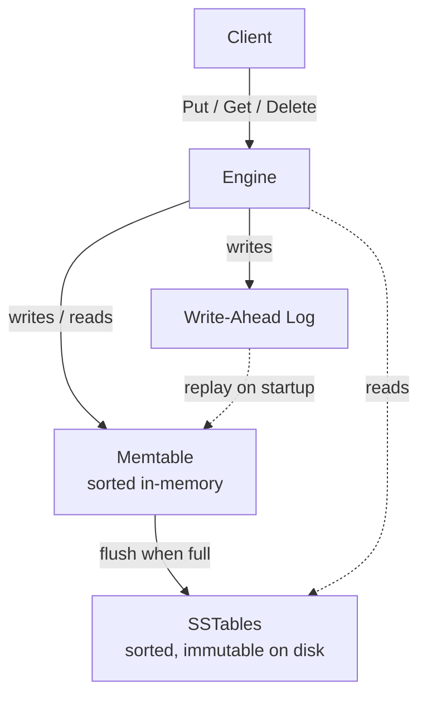

# KV Engine

[](https://github.com/IsaacCheng9/kv-engine/actions/workflows/test.yml)

A key-value storage engine in C++20 with LSM-tree architecture.

## Key Features

- **Write-ahead logging** – crash recovery via WAL replay with CRC32 integrity
  checks and length-prefix framing
- **Sorted in-memory memtable** – `std::map`-backed structure with
  `std::shared_mutex` for concurrent reads and exclusive writes
- **SSTable persistence** – sorted, immutable on-disk files with index blocks
  and footer for efficient point lookups
- **Multi-level reads** – memtable first, then SSTables from newest to oldest
  with first match winning and tombstone semantics for deletes

### Planned Features

- Levelled compaction with background thread and fine-grained locking
- Bloom filters per SSTable to skip unnecessary disk reads on negative lookups
- gRPC API layer for remote client access
- Raft consensus for distributed replication across multiple nodes

## Architecture



## Building

```bash
cmake -B build -DSANITISE=ON
cmake --build build
```

## Testing

```bash
cd build && ctest --output-on-failure
```
